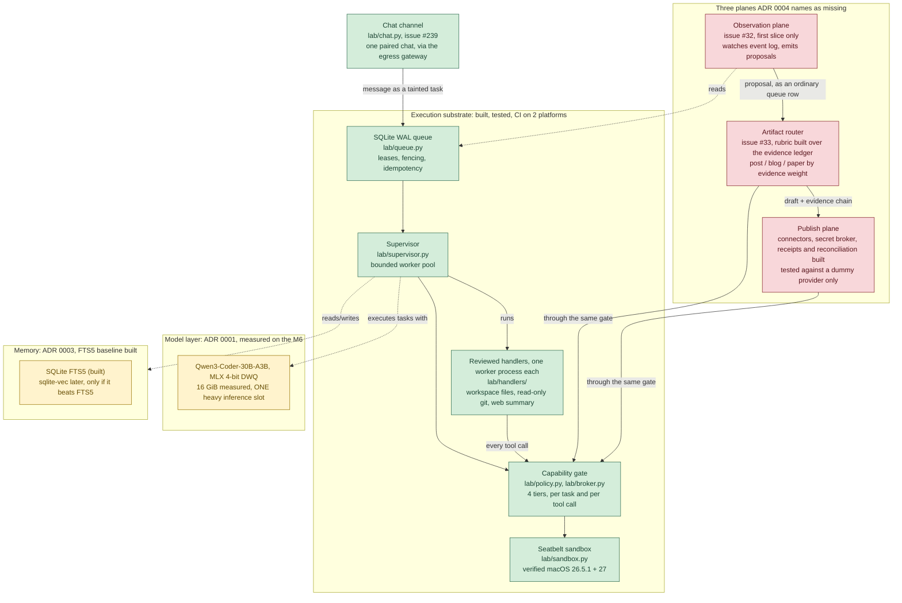

# System architecture, current state

**2026-09-28, deployment status updated 2026-09-30.** What this build actually looks like right now: substrate
plus the three planes ADR 0004 names as missing. Not a design document; the
design is `llm-architects/analysis/consensus/reference-architecture.md`
(frozen, the P1 research artifact) and `docs/decisions/0004-operating-system.md`
(the current target, prose). This page exists so one diagram answers "what
is actually built" without reading either.

Update this when a component's status changes, in the same commit or PR as
the change, the way `README.md`'s status table already works. A diagram that
drifts from the code is worse than no diagram.

## Diagram

Green: built and tested. Yellow: designed, not built. Red: not started.
Dashed arrows are read/write relationships; solid arrows are the flow a
proposal actually takes.

## The constraint the diagram exists to keep visible

**One heavy inference slot**, not one per plane and not one per proposal in
flight. Every box in `planes` competes for the same slot the substrate uses
to execute ordinary tasks. Hundreds of *queued* proposals is fine; hundreds
of *concurrent* model calls is not achievable on this hardware. See ADR
0004's correction section, which this diagram exists partly to stop people
re-losing.

## Status table

| Component | File / doc | Status | Owner |
|---|---|---|---|
| Queue | `lab/queue.py`, `lab/migrations/` | Built, tested. The schema is versioned: numbered SQL migrations run one transaction each and record the version in `PRAGMA user_version`; a failed one rolls back whole, and a database from a newer build is refused, `tests/test_migrations.py` (item 3.1). CHECK constraints cap payload at 64 KiB and result at 1 MiB and keep the attempt counters sane. Commits are durable (synchronous=FULL, fullfsync) and start-up refuses a SQLite with the WAL-reset bug, `tests/test_durability.py`. Races, a Hypothesis state machine and SIGKILL of a real process mid-transaction are covered in `tests/test_races.py` (item 2.4); power-loss durability is not, and waits for the Mac mini. The audit log is append-only by trigger, hash-chained, checkpointed with a signed head and written for every broker call, `lab/audit.py`, `tests/test_audit.py` (item 3.2). Task outputs are stored content-addressed with a descriptor row before success is recorded, `lab/artifacts.py`, `tests/test_artifacts.py` (item 3.3). Online backup and a restore that re-verifies hashes, chain and artifacts, `lab/backup.py`; a daily job restore-checks each new backup and keeps the newest 14, deleting only its own files (#67); drills logged under `ops/drills/` (items 3.4, #91) | n/a |
| Supervisor | `lab/supervisor.py` | Built, tested | n/a |
| Capability gate | `lab/policy.py`, `lab/broker.py` | Rule of Two enforced before the gate, `lab/authority.py` (item 4.1). Approvals are operator-signed (Ed25519) and verified by the supervisor, `lab/operator.py` (item 4.5). Every task carries a derived origin and taint through lineage, `lab/origin.py`, `lab/untrusted.py` (item 4.2). Task-level and per-tool-call: built, tested (item 1.1). Handlers call through a session bound to their task and lease (1.2); reviewed handlers run in a worker process (`lab/worker.py`); separate OS account pending, [#70](https://github.com/roshanaryal1/home-lab/issues/70) | n/a |
| Sandbox | `lab/sandbox.py` | Built, tested on macOS 26.5.1 and 27 | n/a |
| Local tools (M3) | `lab/handlers/workspace.py`, `lab/handlers/git_read.py`, `lab/handlers/web.py`, `lab/broker.py` | Built and tested with hostile input on Linux (#240). Three reviewed handlers run in worker processes, each granted only its broker tools: workspace files (`fs.read`, `fs.list`, `fs.write`, new `fs.search`; notify), read-only git (new `git.status`, `git.log`, `git.diff`; autonomous) and web fetch with summary (new `net.summarize`: the egress gateway, then the bounded model over fixed-schema evidence; notify). Registered by `register_all`; the web handler only when a model and `LAB_WEB_FETCH_HOSTS` are set. Git runs outside the sandbox, made safe by a repository check and a fixed command line (`SECURITY.md`). Not yet run on the M6; ceilings from measured peaks wait for that | [#180](https://github.com/roshanaryal1/home-lab/issues/180) |
| Model adapter | `lab/model.py` | Built against a mock and a stub loopback server: pinned revisions, admission control (tokens, time, residency, one heavy slot; the slot spans processes through `<db>.model.lock`, #211), strict tool-call parsing. Run against the real model on the M6 (2026-09-30): pinned revision, admission refusal and measured budget verified; `kv_bytes_per_token` defaults to the measured 200,000 | [#74](https://github.com/roshanaryal1/home-lab/issues/74) |
| Heavy model | Qwen3-Coder-30B-A3B, MLX 4-bit DWQ build | Chosen and running on the M6 (always-on LaunchAgent, loopback only). The plain 4-bit build corrupted copied text, so the DWQ build is served since 2026-09-30; memory, speed and tool calls **measured**; a second model family not yet compared | [ADR 0001](decisions/0001-heavy-model.md) |
| Python runtime | uv-managed | Chosen; mini needs patch-version pin | [ADR 0002](decisions/0002-python-runtime.md) |
| Memory | `lab/memory.py` (SQLite FTS5) | FTS5 baseline built: provenance, trust, expiry, inspect, correct, revoke (reaches the ledger), delete. `sqlite-vec` embeddings not built and must beat this baseline first | [ADR 0003](decisions/0003-memory.md) |
| Observation plane | `lab/observe.py`, `lab/loop.py` (`lab tick`) | GitHub signals (#39, #46): closed issues and merged PRs become queued proposals. Event-log emitter (`lab/emitter.py`, `lab emit`, #32): three rules (`repeated_failure`, `similar_closed_issues`, `unpublished_measurement`) queue `notify`-tier, event-origin proposals naming the events or issue URLs behind them (`lab chain`). A merged fix with a reproduction is not built | [#32](https://github.com/roshanaryal1/home-lab/issues/32) |
| Nightly self-test and alerts | `lab/selftest.py`, `lab/alert.py` | Built and tested on Linux. On the M6 since 2026-09-30 the nightly self-test and the status check are installed as LaunchDaemons and configured to alert to the system log (an alert has not been triggered yet); a Telegram channel (`lab/telegram_alert.py`) is built but not wired to the machine. `lab selftest --report-ok` also sends a short "ok" each morning (#80), and the dead-man switch ping (`lab/deadman.py`, `lab heartbeat`) is built and tested on Linux but not yet set up on the M6 | H5b, [#79](https://github.com/roshanaryal1/home-lab/issues/79) |
| Lab-account setup plan | `lab/accountplan.py`, `lab setup-plan` | Built and tested as data on Linux; run on the M6 on 2026-09-30, and its four checks came out as expected (`lab` cannot `sudo`, is not an admin, cannot read the operator key or edit a service definition) | H5c, #70 |
| Sleep prevention and logs | `lab/keepawake.py`, `lab/logsetup.py` | Built and tested on Linux; the keep-awake daemon has run on the M6 since 2026-09-30, and the `caffeinate` assertion under a real queue is still to check | H5a |
| Unattended loop | `lab/loop.py`, `lab tick` | Built and tested against a scripted model: proposals are summarized by a tool-less model, recorded as an evidence-ledger claim and routed by the rubric, each step audited. The heavy model runs on the M6, and since 2026-09-30 the loop runs there every five minutes as a LaunchDaemon; its queue is still empty, and it refuses to start without the operator key (#190) | H1 |
| Artifact router | `lab/rubric.py`, `lab/route.py` | Rubric built (7.2): routes a research task by evidence weight over the ledger, refuses thin evidence upward, states conflicts, bounded stop rule. The single-signal v0 in `route.py` remains for the vertical slice. Human review of every route | [#33](https://github.com/roshanaryal1/home-lab/issues/33) |
| Secret broker and connectors | `lab/vault.py`, `lab/connectors.py` | Built and tested with dummy credentials and a fake transport; Keychain path unexercised until the mini | [#15](https://github.com/roshanaryal1/home-lab/issues/15) |
| Publish plane | `lab/publish.py`, `lab/broker.py` | Reviewed publishing built against a dummy provider: approval bound to destination and draft hash, write-ahead receipts, idempotency keys, reconciliation of lost responses. No real destination yet | [#86](https://github.com/roshanaryal1/home-lab/issues/86) |
| Repository sources | `lab/sources.py`, `lab repo`, `lab/broker.py` (`workspace.acquire`), `lab/handlers/repo_read.py` | Built and tested with real git on Linux: operator-signed sources, exact commit ids, approve tier, no hooks, remote or symlinks in the copy, provenance in `workspace_acquisitions`. Local mirrors only; a copy as `lab` from the operator's mirror waits for the Mac | [ADR 0008](decisions/0008-tools-report-control-plane-decides.md) |
| MCP client | `lab/mcp.py`, `lab mcp`, `lab/broker.py` (`mcp.call`) | Built and tested against a fake stdio server on Linux: signed server config, tool allowlist with signed fingerprints, approve tier, untrusted evidence, message, call and time limits, kill on timeout and cancel. Since 2026-10-01 the `mcp.call` handler holds the tool, at the approve tier. The Seatbelt run of a real server waits for the Mac (see the section below) | [#256](https://github.com/roshanaryal1/home-lab/issues/256) |
| Network egress control | `lab/egress.py` | Built, tested with a fake resolver and transport (metadata-address redirect, DNS rebinding, IP-literal spellings); not yet exercised against a real host | [#14](https://github.com/roshanaryal1/home-lab/issues/14) |
| Resource ceilings per task | `lab/worker.py`, `lab/supervisor.py` | Built for reviewed handlers: RSS sampled over the worker process group and `RLIMIT_CPU`, breach kills, fails without retry and is audited. Values unmeasured until the M6; `lab/ceilings.py` (`lab measure-ceilings`) measures each reviewed handler's peaks and suggests values ([#180](https://github.com/roshanaryal1/home-lab/issues/180)) | [#16](https://github.com/roshanaryal1/home-lab/issues/16) |
| `dscl` account enumeration | `lab/sandbox.py` | Accepted, not narrowed; untrusted code is routed to a disposable container instead | [ADR 0007](decisions/0007-isolation-for-untrusted-code.md), [#27](https://github.com/roshanaryal1/home-lab/issues/27) |
| Operational metrics | `lab/metrics.py`, `lab status` | Built: queue depth and ages, worker health, counters for denials, retries, lease losses and forced terminations, all queries over the event log with no second store; model metrics wait for 5.1 | [#89](https://github.com/roshanaryal1/home-lab/issues/89) |
| Chat channel | `lab/chat.py`, `lab chat`, `ops/launchd/com.homelab.chat.plist` | Built and tested against a fake Telegram Bot API behind the real egress gateway: a message from the one paired private chat becomes a tainted `chat` task and the reply comes from its result; any other chat creates nothing and is audited; `/approve` only shows the intent and the signed command for the Mac; `/pause`, `/stop`, `/cancel` and `/deny` only remove authority; the update offset is stored, so nothing is handled twice. The handler is a model answer with no tools until M3. `lab/prereg.py` runs Claim M2 through this path, with a scripted model. Not installed on the M6; the raw-shell bot it replaces is retired by an operator step (setup section 23) | [#239](https://github.com/roshanaryal1/home-lab/issues/239) |
| Operator controls | `lab/control.py`, `lab control`, `lab cancel` | Built: pause, resume, drain and stop as one database row obeyed by the supervisor (a resume is operator-signed and bound to its generation); stop runs the emergency stop and persists across restart. Watchdog, alerts and dead-man switch need the M6 | [#79](https://github.com/roshanaryal1/home-lab/issues/79) |
| Evidence ledger | `lab/ledger.py`, `lab ledger` | Built: research-task record, claims with a status separate from the task's, quote-checked evidence snapshots, a review pass required before a draft is reviewable; the router (7.2) is not yet built on it | [#90](https://github.com/roshanaryal1/home-lab/issues/90) |
| Utility evals | `lab/evals.py`, `evals/tasks.jsonl` | 24 fixed tasks graded deterministically; sealed provenance record; rerun from the record alone. Run on the M6 (records in `evals/runs/`), plus a 70-task held-out tool-call set for the pre-registered H2 and H2b (`docs/PREREGISTRATION.md`) | [#81](https://github.com/roshanaryal1/home-lab/issues/81) |
| Skill store | `lab/skillstore.py`, `lab/skills.py` | Skills as immutable versions with lineage, operator-signed promotion, tier that a skill cannot lower, known-good marks and one-step rollback. The validator/inventory (8.7a) feeds it, and `lab skills import` stores an outside skill as a candidate only (#254). `lab/prereg.py` runs Claim M6 against it. No agent loads from it yet. A script of the active version runs only in the container, through the broker tool `skill.run` (#255). Since 2026-10-01 the `skill.run` handler holds that tool, at the approve tier | [#87](https://github.com/roshanaryal1/home-lab/issues/87) |
| Shadow experiment and grammar | `lab/shadow.py`, `lab/grammar.py`, `evals/shadow_cases.jsonl` | Built and tested against scripted candidates: a candidate's route and confidence are compared with the rubric on 12 labeled cases (per-class confusion, false promotion, abstention, calibration, latency, memory) and can only produce advice; the tool-call JSON Schema is generated from the broker table and sent as `response_format` when configured. Real-model runs are checklist items | H6a |
| Benchmark and tuning gate | `lab/bench.py`, `lab bench` | Built and tested against a scripted adapter: cold start, first token (a one-token request, since the adapter does not stream), decode speed and server memory, sealed with the model revision and lab commit; a setting is recommended only if no task is lost and the gain clears a threshold. Real figures are checklist items | H6b |
| Injection harness | `lab/attacks.py` | 9 benign-plus-hostile scenarios, graded on files, database and network. Against the worst-case stub and against the real model on the M6 (pre-registered H4, and again after the switch to DWQ): 0 of 9 attacks succeed | [#72](https://github.com/roshanaryal1/home-lab/issues/72) |
| Status dashboard | `lab/dashboard.py`, `lab dashboard` | Built and tested: read-only page and JSON over `metrics.collect` and `control.get`, loopback bind enforced, GET only, Host header checked, output escaped, no script or form. Reaching it from another device (a private tunnel to the loopback port) is a checklist item | H7 |
| launchd + watchdog | `lab/service.py`, `ops/launchd/`, `lab watchdog` | Built: heartbeat written from the event loop, a periodic watchdog that kills a supervisor whose heartbeat is stale (pid, start time and supervisor command line checked), and generated LaunchDaemon definitions. Installed on the M6 on 2026-09-30 as six LaunchDaemons (the supervisor runs as the non-admin `lab` account from root-owned code in `/opt/homelab`). After `kill -9` a new supervisor was found at the first check (the drill polls every 2 s); a frozen one was replaced by the watchdog in 96 s and 97 s in two timed runs on 2026-10-06, under the two-minute target, after a gap was fixed in which a supervisor frozen before its first heartbeat was never seen (#271, #275). Startup recovery under launchd with idempotent and non-idempotent tasks in flight is not yet tested on the M6 (the 2026-09-29 crash drills covered requeue, but not under launchd) | [#78](https://github.com/roshanaryal1/home-lab/issues/78), `ops/mac-mini-setup.md` §16 |

## MCP servers through the broker (#256)

`lab/mcp.py` is a small MCP client written by hand: newline-delimited
JSON-RPC 2.0 over a child's stdin and stdout, with `initialize`, `tools/list`
and `tools/call`. No dependency was added.

- The operator lists servers in a signed JSON file (`mcp_servers_file`, or
  `lab mcp --servers`). Each entry holds a name, the exact argument list, the
  allowed tools and the SHA-256 of each one's name, description and input
  schema. `lab mcp snapshot <server>` prints the entry to sign, and signs it
  with `--key`. `lab mcp list [--check]` shows each server's state and, with
  `--check`, compares the live tool list with the signed one.
- The broker has one generic tool, `mcp.call(server, name, arguments)`, not
  one broker tool per server tool. It is approve tier, journaled as
  non-idempotent and classed as untrusted input in `authority.TOOL_LEGS`. A
  handler is granted named servers at registration, as with connectors.
- One tool, because the broker table is reviewed code that also generates the
  model's grammar and the tool signatures in the frozen tool-call corpus
  (`evals/toolcalls-v1.jsonl`). One broker tool per server tool would make
  that table depend on a config file, and both would change silently whenever
  the operator edits it. `mcp.call` is listed in
  `toolcorpus.NOT_IN_CORPUS`, and a test fails if any broker tool is in
  neither the corpus nor that list. The corpus files are unchanged. A new
  `lab eval run --grammar` run gets one more branch in its schema
  (`arguments` is any JSON object). A rerun uses the schema stored in its
  record.
- Each call starts the server fresh under Seatbelt, checks the tool against
  its signed fingerprint, calls it and kills the process group. Output and the
  tool's description come back as `Evidence`.

The owner decided on 2026-10-01 to grant `mcp.call` and `skill.run` to
reviewed handlers now, still at the approve tier (#255, #256):

- `mcp.call` handler (`lab/handlers/mcp_call.py`): server, tool and
  arguments in the payload. Granted `mcp.call`, the servers in the signed
  file and no network. The daemon reads the file named by
  `LAB_MCP_SERVERS`. `register_all` registers the handler only when that
  file is set and every entry verifies. An entry that does not verify stops
  the daemon at start.
- `skill.run` handler (`lab/handlers/skill_run.py`): skill, script and
  optional arguments in the payload. Granted `skill.run` only. Registered
  only when `LAB_CONTAINER_IMAGE` names a pinned image.

Each holds one tool, and every call parks the task until the operator
signs. Both return what came back as untrusted data. Neither has ceiling
samples: a sample would park, so the measurement leaves them off. The tests
are in `tests/test_grant_skill_mcp.py`.

Not yet: the real sandboxed run is the `mcp` step of `ops/mac-session.sh`.

## Related documents

- [`docs/decisions/0004-operating-system.md`](decisions/0004-operating-system.md), the framing this diagram implements
- [`docs/decisions/0005-multi-tenant-proposal-review.md`](decisions/0005-multi-tenant-proposal-review.md), what's adopted vs deferred from a larger enterprise-platform proposal
- [`docs/decisions/0006-authority-rules-and-rollout.md`](decisions/0006-authority-rules-and-rollout.md), the Rule of Two per plane and the staged rollout of research agents tied to gates G1 to G6
- [`docs/decisions/0008-tools-report-control-plane-decides.md`](decisions/0008-tools-report-control-plane-decides.md), tools report what happened and the control plane decides: containers stay behind `skill.run`, repositories enter only through `workspace.acquire`, MCP errors are failures
- [`THREATS.md`](../THREATS.md), the OWASP agentic top 10 mapped to controls, tests and open issues
- [`docs/PLAN.md`](PLAN.md), the research and defect history that led here
- [`docs/PIPELINE.md`](PIPELINE.md), which papers each piece of this feeds
- [`docs/SUBSYSTEMS.md`](SUBSYSTEMS.md), design detail for four specific subsystems
- `llm-architects/analysis/consensus/reference-architecture.md`, the frozen P1 spec this build originally set out to implement
