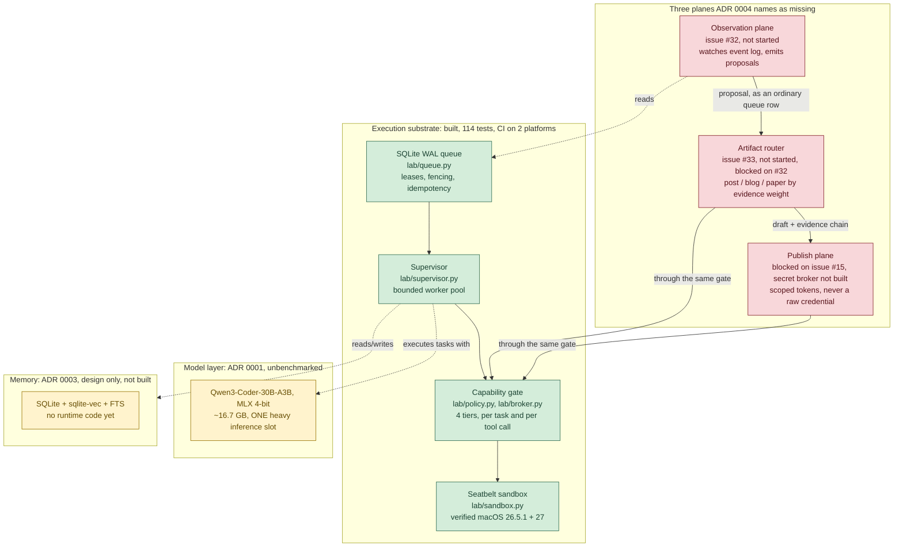

# System architecture, current state

**2026-09-28.** What this build actually looks like right now: substrate
plus the three planes ADR 0004 names as missing. Not a design document; the
design is `llm-architects/analysis/consensus/reference-architecture.md`
(frozen, the P1 research artifact) and `docs/decisions/0004-operating-system.md`
(the current target, prose). This page exists so one diagram answers "what
is actually built" without reading either.

Update this when a component's status changes, in the same commit or PR as
the change, the way `README.md`'s status table already works. A diagram that
drifts from the code is worse than no diagram.

## Diagram

Green: built and tested. Yellow: designed, not built. Red: not started.
Dashed arrows are read/write relationships; solid arrows are the flow a
proposal actually takes.

## The constraint the diagram exists to keep visible

**One heavy inference slot**, not one per plane and not one per proposal in
flight. Every box in `planes` competes for the same slot the substrate uses
to execute ordinary tasks. Hundreds of *queued* proposals is fine; hundreds
of *concurrent* model calls is not achievable on this hardware. See ADR
0004's correction section, which this diagram exists partly to stop people
re-losing.

## Status table

| Component | File / doc | Status | Owner |
|---|---|---|---|
| Queue | `lab/queue.py`, `lab/migrations/` | Built, tested. The schema is versioned: numbered SQL migrations run one transaction each and record the version in `PRAGMA user_version`; a failed one rolls back whole, and a database from a newer build is refused, `tests/test_migrations.py` (item 3.1). CHECK constraints cap payload at 64 KiB and result at 1 MiB and keep the attempt counters sane. Commits are durable (synchronous=FULL, fullfsync) and start-up refuses a SQLite with the WAL-reset bug, `tests/test_durability.py`. Races, a Hypothesis state machine and SIGKILL of a real process mid-transaction are covered in `tests/test_races.py` (item 2.4); power-loss durability is not, and waits for the Mac mini. The audit log is append-only by trigger, hash-chained, checkpointed with a signed head and written for every broker call, `lab/audit.py`, `tests/test_audit.py` (item 3.2). Task outputs are stored content-addressed with a descriptor row before success is recorded, `lab/artifacts.py`, `tests/test_artifacts.py` (item 3.3) | n/a |
| Supervisor | `lab/supervisor.py` | Built, tested | n/a |
| Capability gate | `lab/policy.py`, `lab/broker.py` | Rule of Two enforced before the gate, `lab/authority.py` (item 4.1). Every task carries a derived origin and taint through lineage, `lab/origin.py`, `lab/untrusted.py` (item 4.2). Task-level and per-tool-call: built, tested (item 1.1). Handlers call through a session bound to their task and lease (1.2); reviewed handlers run in a worker process (`lab/worker.py`); separate OS account pending, [#70](https://github.com/roshanaryal1/home-lab/issues/70) | n/a |
| Sandbox | `lab/sandbox.py` | Built, tested on macOS 26.5.1 and 27 | n/a |
| Heavy model | Qwen3-Coder-30B-A3B, MLX 4-bit | Chosen, **unbenchmarked** on the M6 | [ADR 0001](decisions/0001-heavy-model.md) |
| Python runtime | uv-managed | Chosen; mini needs patch-version pin | [ADR 0002](decisions/0002-python-runtime.md) |
| Memory | SQLite + `sqlite-vec` + FTS | Designed, no runtime code | [ADR 0003](decisions/0003-memory.md) |
| Observation plane | `lab/observe.py`, `lab/slice.py` | First slice only (#39, #46): this repo's closed issues and merged PRs become queued proposals. General service not started | [#32](https://github.com/roshanaryal1/home-lab/issues/32) |
| Artifact router | `lab/route.py` | v0 from the slice: one signal at a time, template draft, stops for review. Rubric that can refuse (item 7.2) not built | [#33](https://github.com/roshanaryal1/home-lab/issues/33) |
| Publish plane | n/a | Blocked on the secret broker | [#15](https://github.com/roshanaryal1/home-lab/issues/15) |
| Network egress control | n/a | Open | [#14](https://github.com/roshanaryal1/home-lab/issues/14) |
| Resource ceilings per task | n/a | Open | [#16](https://github.com/roshanaryal1/home-lab/issues/16) |
| `dscl` account enumeration | `lab/sandbox.py` | Accepted, not narrowed; untrusted code is routed to a disposable container instead | [ADR 0007](decisions/0007-isolation-for-untrusted-code.md), [#27](https://github.com/roshanaryal1/home-lab/issues/27) |
| Tailscale-only dashboard | n/a | Not started | reference architecture §11 |
| launchd + watchdog | n/a | Checklist written, not run | `ops/mac-mini-setup.md` |

## Related documents

- [`docs/decisions/0004-operating-system.md`](decisions/0004-operating-system.md), the framing this diagram implements
- [`docs/decisions/0005-multi-tenant-proposal-review.md`](decisions/0005-multi-tenant-proposal-review.md), what's adopted vs deferred from a larger enterprise-platform proposal
- [`docs/decisions/0006-authority-rules-and-rollout.md`](decisions/0006-authority-rules-and-rollout.md), the Rule of Two per plane and the staged rollout of research agents tied to gates G1 to G6
- [`docs/PLAN.md`](PLAN.md), the research and defect history that led here
- [`docs/PIPELINE.md`](PIPELINE.md), which papers each piece of this feeds
- [`docs/SUBSYSTEMS.md`](SUBSYSTEMS.md), design detail for four specific subsystems
- `llm-architects/analysis/consensus/reference-architecture.md`, the frozen P1 spec this build originally set out to implement
